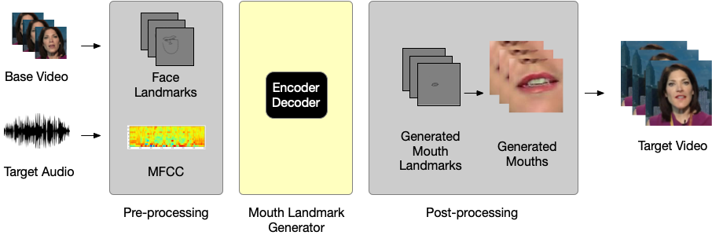
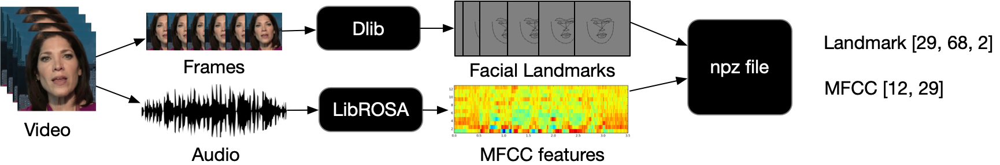
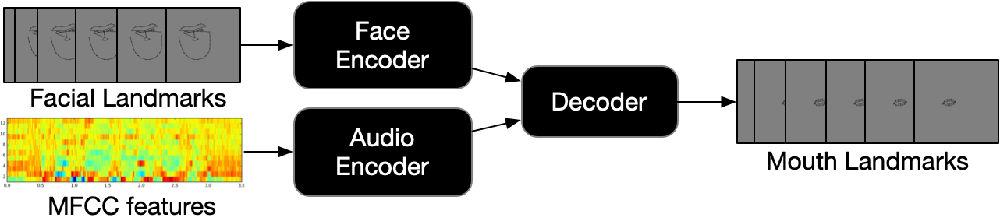
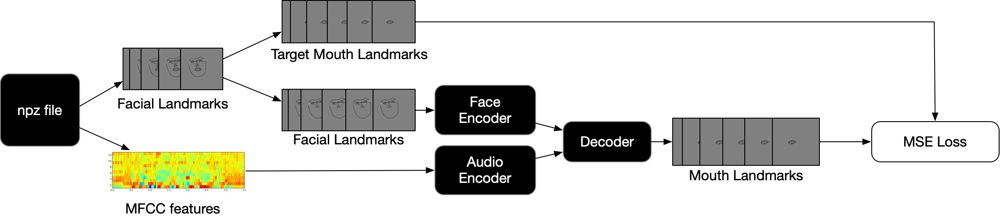
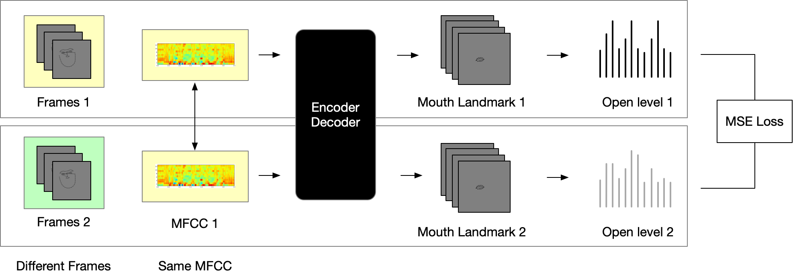
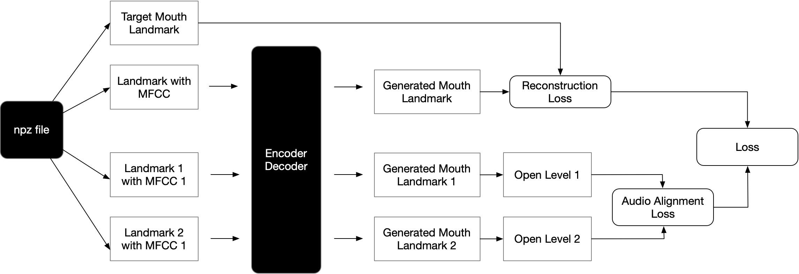
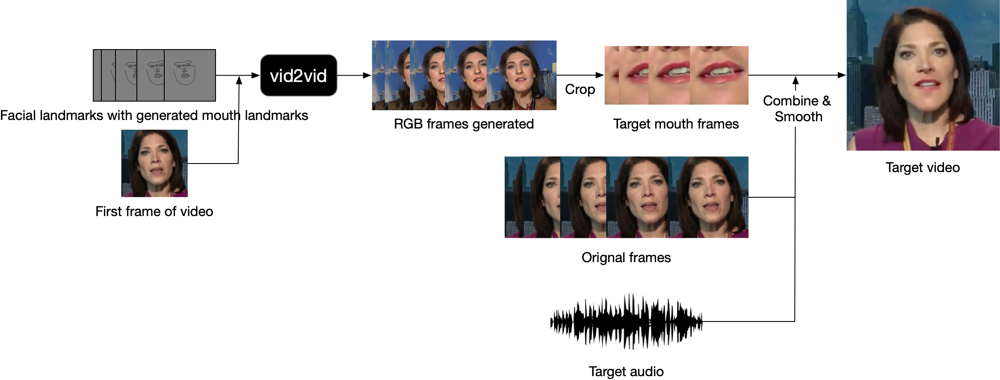
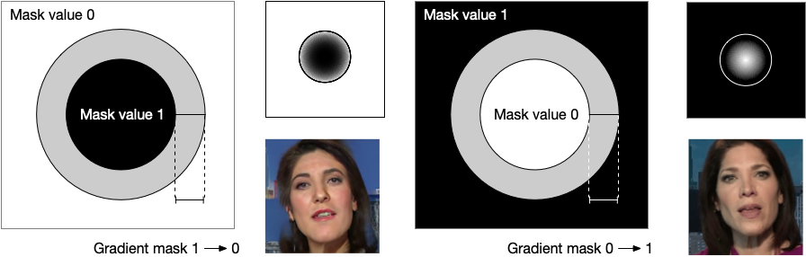
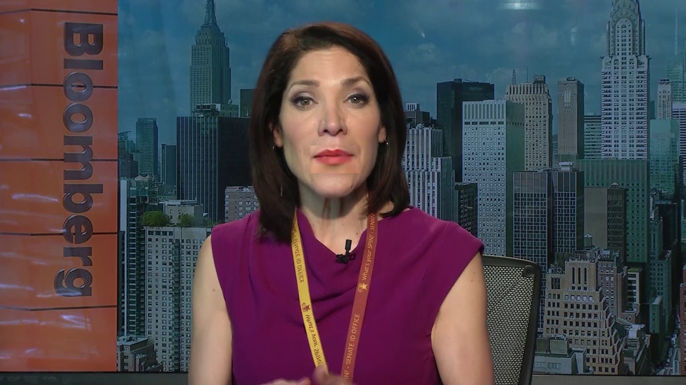
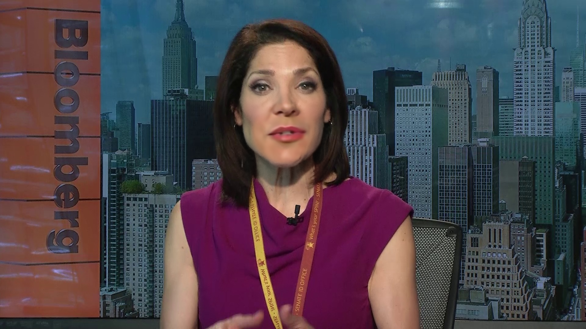

Project: Unsupervised Generative Video Dubbing

Authors: Jimin Tan, Chenqin Yang, Yakun Wang, Yash Deshpande

Project Advisor:  Prof. Kyunghyun Cho

## Introduction
We tackle the problem of generative video dubbing by modifying a video of a person speaking in one language so that the person is perceived as speaking the same content in another language.

**The goal of the project is to transform a video of a person speaking in one language so that it looks like the person is speaking the same content in another language.**
Given a video clip of a person reading a news article in language *S*, our model produces a video clip of the same person reading the same news article however in language *T*.

In the media domain, a robust solution to this problem ensures:
- Fast, real-time translation of video broadcast content
- Detection of maliciously altered video content

## Video Processing Pipeline
Altough this task is gennerative in nature, we propose a novel solution that is different from traditional Generative Adversarial Networks (GANs). Notice that the core of this problem is to generate a series of mouth movements that is conditioned on the audio input -- generating RGB pixels is not a crucial part of this task. Thus, we re-formulate this image generation problem into a regression problem by converting RGB facial images to face landmark coordinates using the Dlib face recognition library. It becomes much more computatinally efficient to generate mouth coordinates than pixel values. The abstraction from RGB pixels to coordinates also simplifies the computational complexity by a large margin. The landmark-to-face generation process is outsourced to the Vid2Vid model from NVIDIA. Here we show a general pipeline for our solution.

<figure>

<figcaption>Figure 1: Project Pipeline</figcaption>
</figure>

  

## Data

### Dataset

- Video clips of people speaking with mouth position fixed in-frame
- Dataset used:
	- [**Lip Reading Sentences in the Wild (LRW)**](http://www.robots.ox.ac.uk/~vgg/data/lip_reading/index.html#about)
- **Bloomberg newscast video** (Internal Evaluation Dataset)

### Data Preprocessing
Since we re-formulate the problem to be a regression problem, we need to transform the dataset to face landmarks using Dlib. We also transform raw audio signals to MFCC features using the LibROSA library. The processed data is saved in `.npz` format.

<figure>

<figcaption>Figure 2: Data Preprocessing</figcaption>
</figure>

  

## Model Strcuture
Our model adpots an encoder-decoder design. We have two encoders for face and audio inputs respectively. The model outputs the landmark coordinates of the mouth area. All encoders and decoders consists of 3 feed-forward layers.

<figure>

<figcaption>Figure 3: Model Structure</figcaption>
</figure>

  

The input to our model includes the audio MFCC features and face landmark coordinates excluding the mouth area (as shown in the figure above). The output is the mouth landmark that is conditioned on both the face (mouth location) and audio features (mouth open status). 

In the case where target audio signals are unavailable, we also build a character-level model where text inputs serve as an alternative of audio features. The major difference between the character encoder and the audio encoder is that the character-level text embeddings are first up-sampled through a 1d transposed convolutional layer so that length of the text context vector matches that of the frames.

## Model Training
We train this model with our pre-processed data (as described above), which includes face landmarks and MFCC audio features.

### Reconstruction Loss
Since we have the ground truth mouth landmark, the first part of the training is to train the network to align the mouth with ground truth given the two conditionals. We use MSE as the loss function for reconstruction.

<figure>

<figcaption>Figure 4: Reconstruction Loss</figcaption>
</figure>

  

### Contrastive Learning
Restruction loss with MSE has a natrual flaw that the loss function emphasize location correctness over open correctness since location difference usually takes a heavier toll on the loss function. Thus, we designed a loss function to emphasize open correctness. 

<figure>

<figcaption>Figure 5: Contrastive Learning with open level function</figcaption>
</figure>

  

The openness measurements(open level) mentioned above is defined as follows:

<figure>

<figcaption>Figure 6: Open level function</figcaption>
</figure>

  

The final training pipeline consists of reconsruction and contrastive learning. We combine them into one loss function at the end:

<figure>

<figcaption>Figure 7: Training Pipeline with reconstruction and contrastive learning</figcaption>
</figure>

  

After we trained this model, we can map a face landmark with corresponding audio directly into a mouth landmark.

## Post Processing

We use Vid2Vid from NVIDIA to convert generated face (with mouth) landmarks to images in the RGB space. Then, we dynamically crop out the mouth area and paste it onto original background image (rectangular crop).

<figure>

<figcaption>Figure 8: Post processing pipeline</figcaption>
</figure>

  

### Paste Smoothing 

The pasted mouth image patch can have borders around it that look unnatural. In addition to the rectangular crop-and-paste above, we apply a circular smoothing technique as shown below.

<figure>

<figcaption>Figure 9: Mouth edge smoothing</figcaption>
</figure>

 

At this stage, for each frame in the video, we have two versions of the output -- (1) rectangular crop-and-paste, and (2) circular filter smoothed paste. For each pair, we use the denoising method described by Ulyanov et al. in their paper Deep Image Prior, which makes use of an _untrained_ ConvNet that extracts good priors of images. 

The results of all three smoothing stages are shown below:

<figure>
 <em>	</em>   <em>	</em> 
</figure>

## Result

This is a 10-second video of a person originally speaking Spanish but conditioned on English audio.

<iframe src="https://drive.google.com/file/d/1tVfDd0cn6nh4w_KBQi8AXc8L8gQHuuhj/preview" width="480" height="270"></iframe>

  
